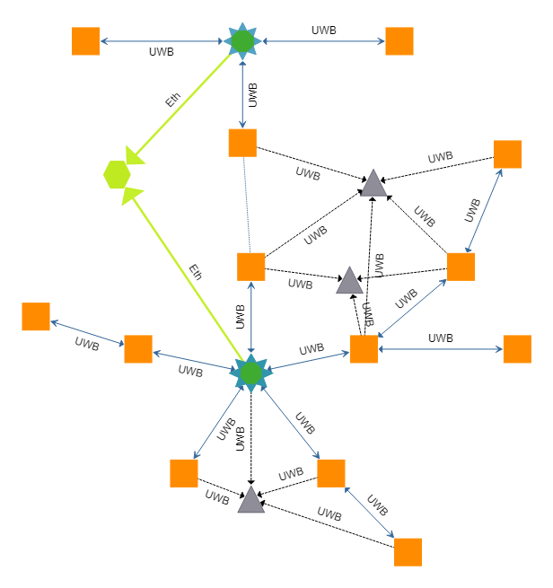
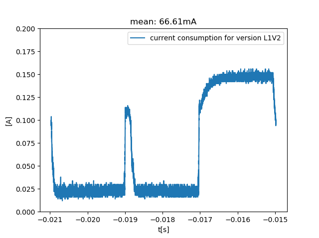
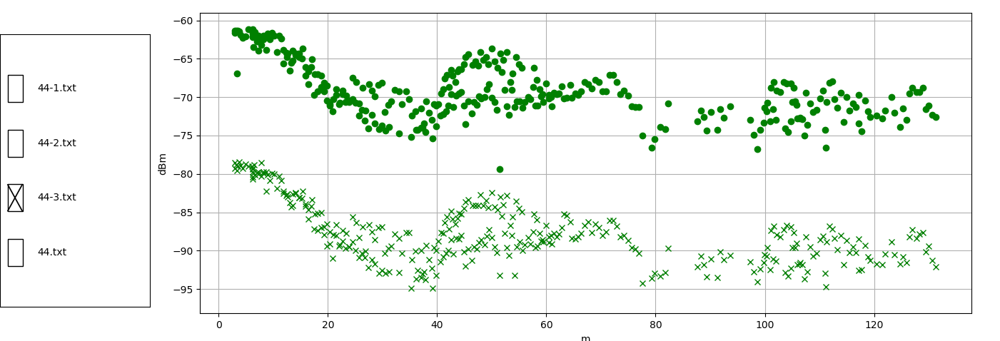

.. _System architecture:

========================
System architecture
========================

General
========================

System consist from calculation server and 4 basic types of devices:

#. Remote server (light green)
#. Sink (dark green) with Ethernet gateway (blue) 
#. Anchor (orange)
#. Tag (gray)

*Sink*, *Anchor* and *Tag* device has possibility to send messages via UWB radio via our dedicated stack.
UWB transceiver is DW1000 used inside DWM1001 module.
Also each of them device also has possibility to send bluetooth messages via Nordid stack with soft device s132.
It is rejected for devices to simultaneously transmit messages via UWB and BT (by our software).

*Sink* witk *Gateway* are connected via internal SPI interface.
*Gateway* is connected with *Remote server* via ethernet 10/100 MBit

After turn on, each device broadcast :ref:`INF_DEVICE_TURN_ON` via UWB radio.

During normal work, each device send an :ref:`INF_BEACON` message to theirs
neighbors when nobody sends messages directly to him.
Time between broadcast messages is specified in device settings, by default it's *5s*.

Many frames are transmitted from device to sink via UWB network with *CARRY* protocol.
It is possible to use only sinks in architecture to avoid this situations.

Possible use cases
==================

**ToF measuring**

This is a main use case for this product.

First use case is measuring distances with Time of Flight method (*ToF*). In this situation sink
sends measuring initialization message to mobile tags. In this message is specified anchor to measure with.
Delay between measures is defined in sink settings, by default it is 5ms.
Most distance measurement consist from 4 messages, INIT, POLL, RESP and FIN. This exchange takes about 3 ms.
Then distance is buffered in anchors. Polling from this buffer is realized in program main loop.
After poll measurement package is send to sink device [1]_.

**TDoA measuring**

This is our innovative branch for future measuring methods.

In this use case *anchors* periodically send messages to theirs neighbors and then this message (from each neighbor)
is transmitted to sink [1]_. Period between this packets is about 2s.

Situation looks similar for *tags*. Each tag periodically broadcast message and each anchor in neighborhood
send corresponding message to sink [1]_. 

**Command invoked**

This is a case when user or remote server ask anchor or tag about something or send to them new settings.
After *anchor* or *tag* receive ask then send response to sink [1]_.
This is quite rare situation. Measurement are working independently from this use case.

**Firmware upgrade**

Whole use case is divided into a few parts.

#. Remote server or user start firmware upgrade action.
#. Remote server sends new firmware to gateway device via ethernet.
#. Gateway send firmware upgrade to target device via sink.
#. Target device send ack after each received message.
#. Go back to point 3 until whole firmware is send.
#. When complete firmware is saved in target device then device goes through reset and start test of a new firmware.

In this situation sink is working as proxy device for gateway. 
Measurement are working independently from this use case.
When firmware update failed then device should still work properly.

Firmware test is coordinated with our dedicated boot-loader software.
Test takes about 8 seconds. When in this time device connect to any other device
then it is treat as a valid otherwise device should return to previous version of firmware.

More details about firmware upgrade protocol is in firmware documentation in description of FU.h file.

Radio settings
========================

Default settings::

    .dwt_config.chan = 5,                      \
    .dwt_config.prf = DWT_PRF_64M,             \
    .dwt_config.txPreambLength = DWT_PLEN_128, \
    .dwt_config.rxPAC = DWT_PAC8,              \
    .dwt_config.txCode = 10,                   \
    .dwt_config.rxCode = 10,                   \
    .dwt_config.nsSFD = 1,                     \
    .dwt_config.phrMode = DWT_PHRMODE_STD,     \
    .dwt_config.sfdTO = 0,                     \
    .dwt_config.dataRate = DWT_BR_6M8,         \
    .dwt_txconfig.PGdly = 0xC0,                \
    .dwt_txconfig.power = 0x0E080222,          \
    .smart_tx = 1,                             \

This power corresponding to::

  P1: +18dB +7dB ( frame duration below 0.125 ms)
  P2: +18dB +4dB ( frame duration below 0.25 ms)
  P3: +18dB +1dB ( frame duration below 0.5 ms)
  P4: +15dB +1dB (longer frames)

For more detailing description see `DW1000 User manual`__.

.. _DWUserManual: https://www.decawave.com/sites/default/files/resources/dw1000_user_manual_2.11.pdf 

__ _DWUserManual_

Radia section is untouched by hardware so from this point of view evertything should work same as in certified module

Current consumption
========================

For this test device was in:

#. Idle for 2 ms
#. Send 30 bytes of data
#. Idle for 2ms
#. Receive packets for 2ms

RSSI measurement
========================

RSSI was measured when one of device was at 4m height connected to metal light post.
Second device was held in hand and connected to mobile computer.
There wasn't any obstacles between devices.

.. [1] Via UWB radio but with possibility to use only sink in architecture to overcome this limitation