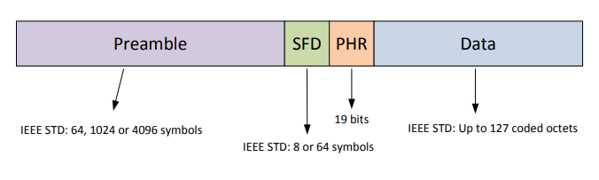
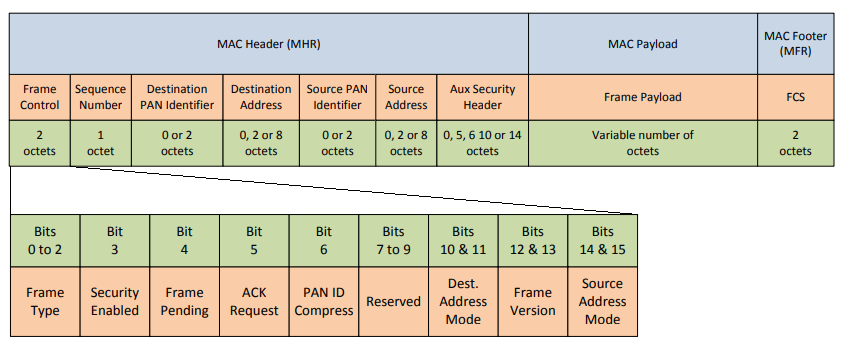

.. _Radio properties:

========================
Radio properties
========================

General
========================

Each device has UWB and BT Radio

UWB Radio
========================

Transmission power
-----------------------------------

Maximal available power is specified by low.
By CEPT ECC, ECC Decision of 24 March 2006 on the harmonised condi-
tions for devices using Ultra-Wideband (UWB) technology in bands
below 10.6 GHz (ECC/DEC/(06)04):

======== ==============  ==============  ================  =============
channel  min freq [MHz]  max freq [MHz]  max average EIRP  max peak EIRP
======== ==============  ==============  ================  =============
1        3244.8          3744            -85 dBm/MHz       -45 dBm/50MHz
2        3774            4243.2          -85 dBm/MHz       -45 dBm/50MHz
3        4243.2          4742.4          -70 dBm/MHz       -30 dBm/50MHz
4        3328            4659.2          -85 dBm/MHz       -45 dBm/50MHz
5        6240            6739.2          -41.3 dBm/MHz     0 dBm/50MHz
7        5980.3          6998.9          -70 dBm/MHz       -30 dBm/50MHz
======== ==============  ==============  ================  =============

UWB Frame structure
-----------------------------------

**PHR** consist 6-bit SECDED (Single error correct, Double error Detect).

UWB Header synchronization
-----------------------------------

Recommended preamble lengths:

===============  ============================================== 
 Data Rate       Recommended preamble sequence length
===============  ============================================== 
6.8 Mbps         64 or 128 or 256
850 kbps         256 or 512 or 1024
110kbps          2048 or 4096
===============  ============================================== 

===============  =================  ============================= 
 Mean PRF (MHz)  #Chips Per Symbol  Preamble Symbol Duration (ns)
===============  =================  ============================= 
16 nominal       496                993.59
64 nominal       508                1017.63
===============  =================  ============================= 

The length-8 **SFD** sequence is: 0, +1, 0, -1, +1, 0, 0, -1

The length-64 **SFD** sequence is: 0, +1, 0, -1, +1, 0, 0, -1, 0, +1, 0, -1, +1, 0, 0, -1, -1, 0, 0, +1, 0, -1, 0, +1, 0, +1,
0, 0, 0, -1, 0, -1, 0, -1, 0, 0, +1, 0, -1, -1, 0, -1, +1, 0, 0, 0, 0, +1, +1, 0, 0, -1, -1, -1, +1, -1, +1, +1, 0, 0, 0, 0, +1,
+1

.. image:: img/UWBDefaultPreambleCodesAndFrequencys.PNG

MAC Frame structure
-----------------------------------

